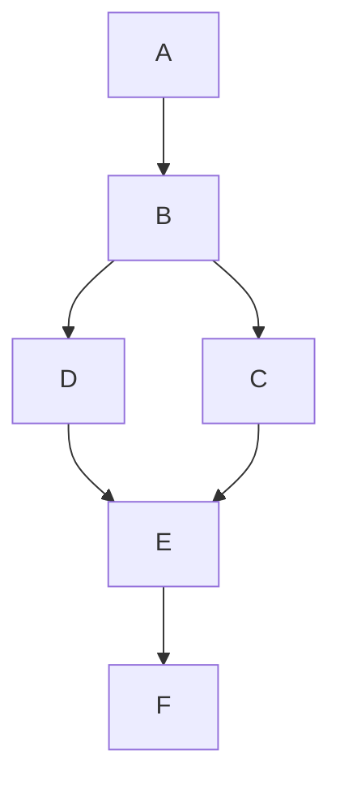

## Question

You have a graph of `n` nodes labeled from `0` to `n - 1`. You are given an integer n and a list of `edges` where `edges[i] = [ai, bi]` indicates that there is an undirected edge between nodes `ai` and `bi` in the graph.

Return `true` _if the edges of the given graph make up a valid tree, and_ `false` _otherwise_.

**Example 1:**


    Input: n = 5, edges = [[0,1],[0,2],[0,3],[1,4]]
    Output: true

**Example 2:**


    Input: n = 5, edges = [[0,1],[1,2],[2,3],[1,3],[1,4]]
    Output: false

**Constraints:**

- `1 <= n <= 2000`
- `0 <= edges.length <= 5000`
- `edges[i].length == 2`
- `0 <= ai, bi < n`
- `ai != bi`
- There are no self-loops or repeated edges.

## Links
Question [here](https://leetcode.com/problems/graph-valid-tree/description/) and solution [here](https://github.com/etherion-1337/LeetCode/blob/master/medium/261_graph_valid_tree/solution.py)

## Solution

### concept
This question is very similar to [207. Course Schedule](/posts/lc-207/) with **one key differences: the graph is undirected**
This will cause two changes:
1. in *directed* graph we are checking if the current (active) path has cycle exhaustively with DFS to follow through all possible path (with directions). we should use `visited.remove(curr_node)` after we are done with the current node because if we don't, it will give wrong answer. For example, our active path is `A -> B -> C -> E -> F` and there is not cycle, and if we do not remove the nodes during backtracking (i.e. `C, E, F`) and go from `A -> B -> D -> E -> F` we will falsely conclude there is a cycle since `E` and `F` is in the visited set. But in a directed graph, there is no cycle. If the graph is *undirected*, then this is a cycle and we *do not removing nodes* during traversal (if we remove, it will be wrong since this is a cycle if the graph is undirected). So in undirected graph where we check for cycles, we do not remove node.
2. the adjacency list has to add both way (i.e. treat the graph as pointing both directions). This means that during DFS, the node's parents will be visited since it is also the neighbors, this will cause the algorithm to falsely identify cycle. So we have to ignore the parent node during DFS.


### code

```python
class Solution:
    def validTree(self, n: int, edges: List[List[int]]) -> bool:
        adj_list = {i: [] for i in range(n)}
        for u, v in edges:
            adj_list[u].append(v)
            adj_list[v].append(u)
        visited = set()
        
        def dfs(node, parent):
            if node in visited:
                return False  # cycle detected
            
            visited.add(node)
            for nei in adj_list[node]:
                if nei == parent:  # ignore back edge to parent
                    continue
                if not dfs(nei, node):
                    return False

            return True
        
        if dfs(0, -1) and len(visited) == n:
            return True
        else:
            return False
    
```
## Complexity
time: $O(V + E)$      
space: $O(V + E)$ 